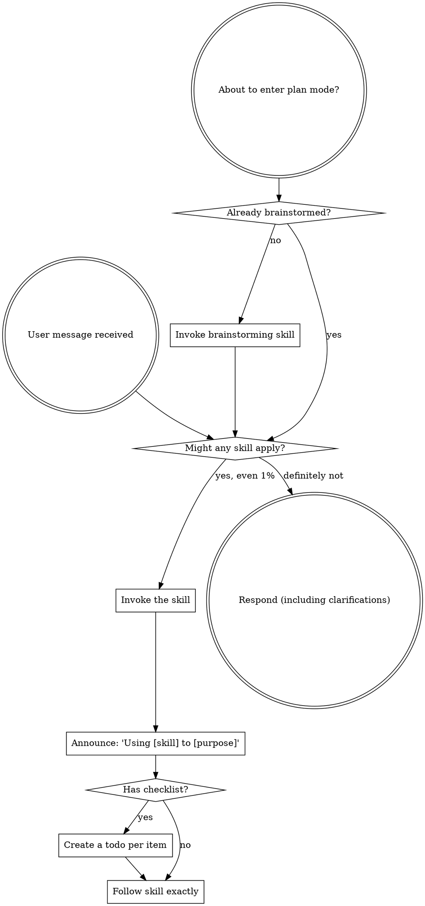

<SUBAGENT-STOP>
If you were dispatched as a subagent to execute a specific task, skip this skill.
</SUBAGENT-STOP>

<EXTREMELY-IMPORTANT>
If you think there is even a 1% chance a skill might apply to what you are doing, you ABSOLUTELY MUST invoke the skill.

IF A SKILL APPLIES TO YOUR TASK, YOU DO NOT HAVE A CHOICE. YOU MUST USE IT.

This is not negotiable. This is not optional. You cannot rationalize your way out of this.
</EXTREMELY-IMPORTANT>

## Instruction Priority

Super skills override default system prompt behavior, but **user instructions always take precedence**:

1. **User's explicit instructions** (CLAUDE.md, GEMINI.md, AGENTS.md, direct requests) — highest priority
2. **Super skills** — override default system behavior where they conflict
3. **Default system prompt** — lowest priority

If CLAUDE.md, GEMINI.md, or AGENTS.md says "don't use TDD" and a skill says "always use TDD," follow the user's instructions. The user is in control.

## How to Access Skills

**Never read skill files manually with file tools** — always use your platform's skill-loading mechanism so the skill is properly activated.

**In Claude Code:** Use the `Skill` tool. When you invoke a skill, its content is loaded and presented to you — follow it directly.

**In Codex:** Skills load natively. Follow the instructions presented when a skill activates.

**In Copilot CLI:** Use the `skill` tool. Skills are auto-discovered from installed plugins.

**In Gemini CLI:** Skills activate via the `activate_skill` tool. Gemini loads skill metadata at session start and activates the full content on demand.

**In other environments:** Check your platform's documentation for how skills are loaded.

## Platform Adaptation

Skills speak in actions ("dispatch a subagent", "create a todo", "read a file") rather than naming any one runtime's tools. For per-platform tool equivalents and instructions-file conventions, see [claude-code-tools.md](references/claude-code-tools.md), [codex-tools.md](references/codex-tools.md), [copilot-tools.md](references/copilot-tools.md), [gemini-tools.md](references/gemini-tools.md), [pi-tools.md](references/pi-tools.md), and [antigravity-tools.md](references/antigravity-tools.md). Gemini CLI users get the tool mapping loaded automatically via GEMINI.md.

# Using Skills

## The Rule

**Invoke relevant or requested skills BEFORE any response or action.** Even a 1% chance a skill might apply means that you should invoke the skill to check. If an invoked skill turns out to be wrong for the situation, you don't need to use it.

## Red Flags

These thoughts mean STOP—you're rationalizing:

| Thought | Reality |
|---------|---------|
| "This is just a simple question" | Questions are tasks. Check for skills. |
| "I need more context first" | Skill check comes BEFORE clarifying questions. |
| "Let me explore the codebase first" | Skills tell you HOW to explore. Check first. |
| "I can check git/files quickly" | Files lack conversation context. Check for skills. |
| "Let me gather information first" | Skills tell you HOW to gather information. |
| "This doesn't need a formal skill" | If a skill exists, use it. |
| "I remember this skill" | Skills evolve. Read current version. |
| "This doesn't count as a task" | Action = task. Check for skills. |
| "The skill is overkill" | Simple things become complex. Use it. |
| "I'll just do this one thing first" | Check BEFORE doing anything. |
| "This feels productive" | Undisciplined action wastes time. Skills prevent this. |
| "I know what that means" | Knowing the concept ≠ using the skill. Invoke it. |

## Skill Priority

When multiple skills could apply, use this order:

1. **Process skills first** (brainstorming, systematic-debugging) - these determine HOW to approach the task
2. **Implementation skills second** (frontend-design, mcp-builder) - these guide execution

"Let's build X" → brainstorming first, then implementation skills.
"Fix this bug" → systematic-debugging first, then domain-specific skills.

## Skill Types

**Rigid** (TDD, systematic-debugging): Follow exactly. Don't adapt away discipline.

**Flexible** (patterns): Adapt principles to context.

The skill itself tells you which.

## User Instructions

Instructions say WHAT, not HOW. "Add X" or "Fix Y" doesn't mean skip workflows.

# Writing Prose

Write prose in ASD-STE100 Simplified Technical English (Issue 9: 53 rules in 9 sections, 875 approved words). This applies to documentation, READMEs, pull-request text, error messages, release notes, comments, tool descriptions, system prompts, and agent-to-agent messages. It does not apply to code, identifiers, or command syntax. It is not for marketing copy, essays, or anything that needs a voice — STE strips voice on purpose.

Three ways to use it:

- **write** — produce new text in STE.
- **rewrite** — convert existing text to STE. Keep every fact.
- **review** — do not rewrite. Output a table (`Rule | Original | Simplified`), one row per violation, then one line on anything you left alone and why.

## Rules

Numbers in parentheses are rule numbers in ASD-STE100 Issue 9.

WORDS
- Use one name for one thing (1.11, 9.4). Do not rotate check / verify / validate / confirm for the same action — pick one and reuse it. Certified STE uses "make sure" or "examine".
- Use the short common word: start (not begin/commence/initiate), use (not utilize/leverage), help (not facilitate), make sure (not ensure/verify), do (not perform/conduct), give or supply (not provide), before (not prior to), after (not subsequent to), about (not regarding/concerning), get (not obtain/acquire), show (not demonstrate), also (not additionally/furthermore/moreover).
- Give each word one meaning (1.3). "fall" means to move down, not to decrease.
- No marketing adjectives: seamless, robust, powerful, cutting-edge, effortless, world-class, next-generation, revolutionary.
- American spelling (1.14).

VERBS
- Active voice. "the parser reads the file", not "the file is read by the parser". Procedures: always. Descriptive text: passive is permitted only when the actor is unknown or irrelevant (3.6).
- A past participle used as an adjective is not passive and is correct (3.3): "the valve is closed", "the field is required".
- Only simple tenses (3.2): infinitive, imperative, simple present, simple past, simple future. No present perfect: "we received the report", never "we have received the report".
- No stacked auxiliaries (3.4). Not "it is important to note that this may help to improve". Write "this improves X".
- Use a verb for an action (3.7): "analyze the log", not "perform an analysis of the log".
- No "-ing" main verb where a simple tense works (3.5).
- No phrasal verbs (9.3): spin up, dive into, kick off, roll out.

SENTENCES
- One instruction per sentence, unless two actions happen at the same time (5.2). Max 20 words (instruction, 5.1), max 25 (descriptive, 6.3).
- When a condition comes before its command, divide them with a comma (5.4): "If the test fails, read the log."
- Do not drop words or articles to compress (4.2, 4.5): "Remove the bolts from the panel", never "Remove bolts from panel". No contractions.
- Connect related sentences with plain connectors — then, but, thus, as a result (4.4). STE is short sentences, not disconnected ones.

NOUNS
- Multi-word nouns have at most three words (2.1). Unpack "the agent task queue priority handler" into "the handler that sets task-queue priority", or hyphenate.
- Define an abbreviation at first use, then use the abbreviation.

PUNCTUATION
- No semicolons (8.1). Write two sentences. (Note: the em dash is not banned by STE, only the semicolon is — add "no em dash" yourself if you want it gone.)

STRUCTURE
- One topic per paragraph (6.5), max six sentences (6.6). For steps, use a numbered vertical list, one action per item, imperative form. Put a condition before its command.
- Safety text (strict mode): WARNING = risk of injury, CAUTION = risk of damage, NOTE = information only, never an instruction (7.1, 5.5). Start with the command or condition, then give the risk (7.2, 7.3). Put it directly before the step it protects, not at the top of the procedure.

## Guards

- Never drop a fact, number, condition, or scope qualifier to satisfy a length cap. Keep the longer sentence and flag it.
- Preserve code identifiers, part numbers, units, error strings, and safety wording exactly.
- Change the smallest span that fixes a violation. Do not restyle text a rule does not touch.
- If the input already complies, return it unchanged and say so.
- Write only the requested text. No preamble, no summary, no closing remarks.

## Modes

- **strict** — procedures, runbooks, safety text, error messages: apply every rule and both length caps, plus the strict word set: but (not however), because (not since, for causes), can (not may), must (not should/shall), use or with (not using), obey (not follow, for instructions), push (not press, for physical controls).
- **STE-flavored** — general prose (READMEs, PR descriptions, docs): apply the sentence, paragraph, tense, active-voice, noun-cluster, and no-phrasal-verb discipline; relax the 875-word dictionary lockdown and the strict word set so the text keeps enough range to read naturally.

## Recurring Errors

ASD-STE100 Issue 9 closes its dictionary introduction with a list of the errors
that writers make most often — the words people reach for on autopilot, with the
approved replacement for each. This is that list, as data. It is a small
factual excerpt of the standard.

Approved replacements are UPPERCASE, the way the dictionary prints them. Some
replacements change the part of speech (check as a verb becomes CHECK the noun:
"do a check") — those need a different sentence construction, not a
word-for-word swap.

| # | Do not write | Write |
|---|---|---|
| 1 | acceptable (adj) | PERMITTED |
| 2 | alternate (adj) | ALTERNATIVE |
| 3 | any (adj) | none, or a different sentence construction |
| 4 | avoid (v) | PREVENT |
| 5 | both (adj) | THE TWO |
| 6 | check (v) | CHECK (n) — "do a check" |
| 7 | cover (v) | COVER (n) |
| 8 | complete (adj) | COMPLETED |
| 9 | damage (v) | DAMAGE (n) |
| 10 | ensure (v) | MAKE SURE |
| 11 | fit (v) | INSTALL |
| 12 | follow (v) | OBEY |
| 13 | further (adj) | MORE |
| 14 | further (adv) | MORE |
| 15 | have to (v) | an action verb in the imperative form |
| 16 | however (adv) | BUT |
| 17 | insert (v) | PUT |
| 18 | main (adj) | PRIMARY |
| 19 | may (v) | CAN |
| 20 | need (v) | NECESSARY (adj) |
| 21 | now (adv) | AT THIS TIME |
| 22 | old (adj) | REMAINING, USED, EXPIRED |
| 23 | over (prep) | ABOVE, ON, ALONG |
| 24 | people (n) | PERSON, PERSONNEL |
| 25 | perform (v) | DO |
| 26 | portion (n) | PART |
| 27 | press (v) | PUSH |
| 28 | reach (v) | GET |
| 29 | repeat (v) | DO … AGAIN |
| 30 | required (v) | NECESSARY (adj) |
| 31 | rotate (v) | TURN |
| 32 | secure (v) | ATTACH, SAFETY |
| 33 | shall (v) | MUST |
| 34 | should (v) | MUST |
| 35 | since (conj) | BECAUSE |
| 36 | test (v) | TEST (n) |
| 37 | therefore (adv) | THUS, AS A RESULT |
| 38 | under (prep) | BELOW, IN, LESS THAN |
| 39 | using (v) | USE, WITH |

### The ones that matter for software docs

Most of this list is aerospace muscle memory. Ten entries show up constantly in
engineering prose and are worth internalizing even in flavored mode:

- **ensure → make sure** — the single most common one in READMEs.
- **however → but** and **therefore → thus / as a result** — cheaper connectors,
  same logic.
- **since → because** — "since" is banned because it can mean time or cause. In
  docs this ambiguity is real: "since the server restarted" is both.
- **may → can** and **should / shall → must** — permission and obligation
  language. If it is optional, say "can". If it is not, say "must".
- **perform → do** — "perform an analysis" is the nominalization pattern.
- **using → use / with** — "Using the CLI, run…" hides the actor. "Run … with
  the CLI."
- **check / test as verbs** — STE makes them nouns ("do a check", "do a test")
  so the action verb stays unambiguous. In software prose, keeping "check" as a
  verb is fine — but pick one word for the action and never rotate synonyms.

Strict mode enforces the strict subset (however, since, may, should, shall,
using, follow). Flavored mode leaves them alone.

## Verify

Before you present the text, check it against this list:

1. Any sentence over 20 words? Split it.
2. Any semicolon? Replace with a period.
3. Any contraction? Expand it.
4. Any present perfect ("has/have received") or modal stack? Use a simple tense.
5. Any passive voice with a known actor? Make it active.
6. Any "-ing" main verb, nominalization ("perform an analysis"), or phrasal verb ("spin up")? Replace with a plain verb.
7. Any multi-word noun of four or more words? Unpack it.
8. Any dropped article ("Remove bolts from panel")? Restore it.
9. Same thing named two ways? Pick one name.

## Scope

The mechanical rules above are what removes slop. Full STE also needs human judgment (the right technical noun, whether a sentence "makes good sense") — a checker cannot certify that, and slop is not about that. These rules fix the FORM of slop. They cannot make a hollow paragraph true.

The full standard is free at https://asd-ste100.org (do not paste it in full; it is copyrighted). This guidance is unofficial and not affiliated with ASD. ASD-STE100 is a registered EU trademark (No. 017966390).
